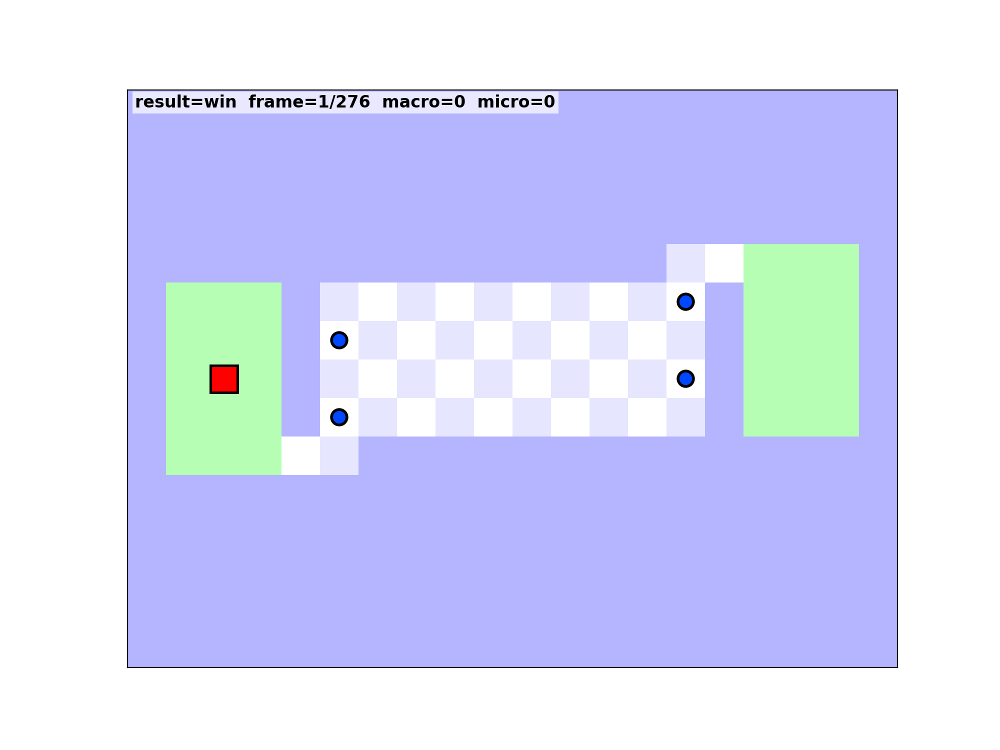

# World's Hardest Game RL

A reproducible reinforcement learning project built on a Java clone of **World's Hardest Game**.

This repo includes:
- The original playable Java game
- A deterministic, headless level-1 simulator for RL
- A planner-assisted Q-learning trainer
- A watcher that renders trained rollouts as animations

## Demo

The trained policy clearing level 1:



## Quick Start

### 1) Play the original Java game

```bash
java -jar "World's Hardest Game.jar"
```

### 2) Train the RL agent

```bash
python3 rl/train_agent.py
```

This writes the model to:
- `rl/models/level1_qtable.npz`

### 3) Watch the trained agent

```bash
python3 rl/watch_agent.py --model rl/models/level1_qtable.npz
```

Save a fast GIF:

```bash
python3 rl/watch_agent.py --model rl/models/level1_qtable.npz --save rl/models/level1_run_fast.gif --fps 30 --frame-stride 3 --no-gui
```

## Results From Default Setup

- Dot cycle period: `326` simulation ticks
- Action repeat: `4` ticks/action
- Final eval (latest trained artifact): `win_rate=1.000`, `death_rate=0.000`

## Project Layout

```text
src/                         # Original Java game source
lib/                         # Java dependencies (TinySound)
rl/
  whg_env.py                 # Deterministic headless environment
  planner.py                 # A* expert trajectory planner
  train_agent.py             # Tabular Q-learning trainer
  watch_agent.py             # Rollout visualizer / GIF renderer
  models/
    level1_qtable.npz        # Trained policy table
    level1_run.gif           # Full-length rollout GIF
    level1_run_fast.gif      # Faster README demo GIF
```

## Credits

- Original game concept: SnubbyLand / Armor Games
- Java recreation base: Dan Convey
- TinySound library: finnkuusisto
