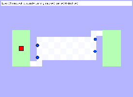

# World's Hardest Game RL

High-fidelity reinforcement learning and planning for **The World's Hardest Game** with strict collision behavior and full 30-level support.

## Full Game Demo

**Preview (GitHub-friendly):**



**Full-resolution strict run (all 30 levels):**
- [GIF file](rl/models/strict_timeout_levels1_30_flashmove_v3_all30.gif)
- [Verification manifest](rl/models/strict_timeout_levels1_30_flashmove_v3_all30_manifest.json)

## Project Status

- Full strict 30/30 level sweep completed
- Enemy movement and collisions modeled with anti-exploit contact death
- Deterministic planner fallback for hard levels

## Quick Start

### Play the Java clone

```bash
java -jar "World's Hardest Game.jar"
```

### Train/watch level-1 baseline

```bash
python3 rl/train_agent.py
python3 rl/watch_agent.py --model rl/models/level1_qtable.npz
```

### Reproduce strict all-30 gameplay GIF

```bash
python3 rl/render_strict_timeout_sweep.py \
  --dataset-dir rl/data/flash_levels \
  --levels 1-30 \
  --enemy-hit-radius 6.0 \
  --planner-max-expand 1200000 \
  --planner-max-segments 1200 \
  --planner-retry-cap 4200000 \
  --per-level-timeout-sec 720 \
  --save rl/models/strict_timeout_levels1_30_flashmove_v3_all30.gif \
  --manifest-out rl/models/strict_timeout_levels1_30_flashmove_v3_all30_manifest.json
```

## Repository Layout

```text
src/                         Java clone source
lib/                         Java dependencies
flash_xfl/                   Decompiled XFL source (original game)
rl/
  data/flash_levels/         Extracted level data + walkable masks
  whg_full_env.py            Full strict environment
  full_planner.py            Time-aware planner + hard-level fallback
  render_strict_timeout_sweep.py
  render_strict_best_effort.py
  train_full_agent.py
  watch_full_agent.py
  models/
    strict_timeout_levels1_30_flashmove_v3_preview.gif
    strict_timeout_levels1_30_flashmove_v3_all30.gif
    strict_timeout_levels1_30_flashmove_v3_all30_manifest.json
```

## Credits

- Original game: SnubbyLand / Armor Games
- Java recreation base: Dan Convey
- TinySound library: finnkuusisto
